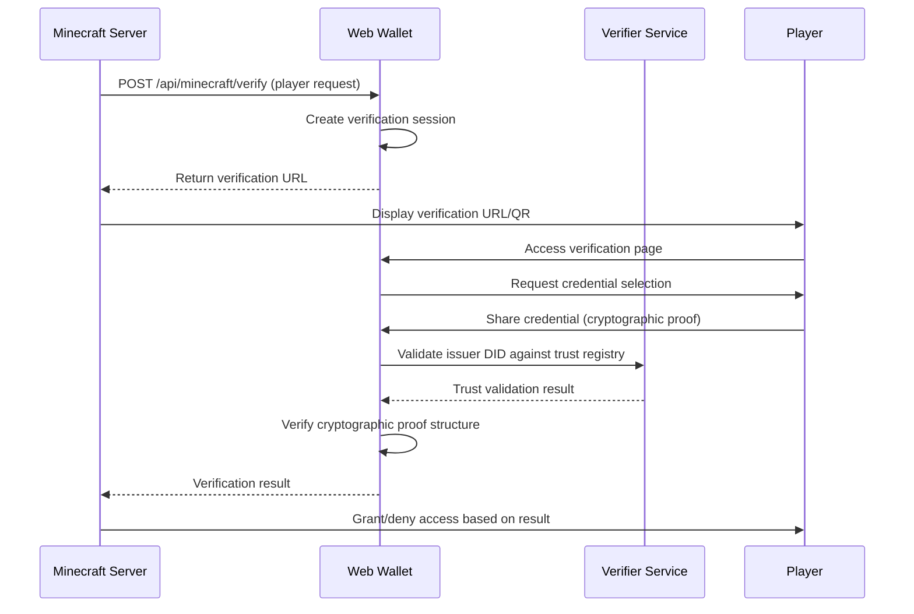

# VR Web Wallet - Comprehensive Technical Documentation

## Table of Contents
1. [Architecture Overview](#architecture-overview)
2. [Core Components](#core-components)
3. [Cryptographic Implementation](#cryptographic-implementation)
4. [API Endpoints](#api-endpoints)
5. [Database & Storage](#database--storage)
6. [Minecraft Integration](#minecraft-integration)
7. [Security Features](#security-features)
8. [Development Guide](#development-guide)

---

## Architecture Overview

### System Architecture
The VR Web Wallet is a **Self-Sovereign Identity (SSI)** system built with **Next.js 14**, implementing **AnonCreds cryptographic proofs** for secure credential verification.

```
┌─────────────────────┐    ┌─────────────────────┐    ┌─────────────────────┐
│   Frontend (React)  │◄──►│   API Layer (REST)  │◄──►│   Storage Layer     │
│                     │    │                     │    │                     │
│ - Credential UI     │    │ - Authentication    │    │ - CouchDB           │
│ - Proof Generation  │    │ - Verification      │    │ - IndexedDB         │
│ - Encryption        │    │ - Trust Registry    │    │ - File Storage      │
└─────────────────────┘    └─────────────────────┘    └─────────────────────┘
           │                           │                           │
           └───────────────┬───────────────────────┬───────────────┘
                          │                       │
           ┌─────────────────────┐    ┌─────────────────────┐
           │  External Services  │    │   Minecraft Server  │
           │                     │    │                     │
           │ - BCovrin Ledger    │    │ - SSI Plugin        │
           │ - Verifier Service  │    │ - Trust Registry    │
           │ - ACA-Py Agents     │    │ - Player Verification│
           └─────────────────────┘    └─────────────────────┘
```

### Technology Stack
- **Frontend**: React 18, TypeScript, Tailwind CSS
- **Backend**: Next.js 14 API Routes
- **Database**: CouchDB (credentials), IndexedDB (client storage)
- **Cryptography**: Web Crypto API, AES-GCM encryption
- **SSI Protocol**: AnonCreds, DIDComm v2
- **External**: BCovrin Ledger, ACA-Py agents

---

## Core Components

### 1. Frontend Components (`/src/components/`)

#### `VRButton.tsx` & `VRCard.tsx`
**Purpose**: VR-optimized UI components for immersive interfaces
**Location**: `/src/components/VRButton.tsx`, `/src/components/VRCard.tsx`
```typescript
// Large buttons optimized for VR/AR interactions
interface VRButtonProps {
  variant: 'primary' | 'secondary' | 'outline' | 'ghost'
  size: 'sm' | 'md' | 'lg'
  loading?: boolean
}
```

#### `CredentialCard.tsx`
**Purpose**: Display credential information in user-friendly format
**Location**: `/src/components/CredentialCard.tsx`
**Key Features**:
- Encrypted credential display
- Attribute decryption UI
- Credential status indicators

#### `LoginForm.tsx`
**Purpose**: Multi-tenant authentication for wallet access
**Location**: `/src/components/LoginForm.tsx`
**Security**: Username/password validation against CouchDB

#### `MinecraftConnection.tsx`
**Purpose**: Minecraft server integration interface
**Location**: `/src/components/MinecraftConnection.tsx`
**Functionality**:
- QR code generation for verification requests
- Real-time verification status updates
- Player connection management

### 2. Page Components (`/src/app/`)

#### Main Dashboard (`page.tsx`)
**Purpose**: Central wallet interface
**Location**: `/src/app/page.tsx`
**Features**:
- Credential overview
- Connection management
- Proof request handling
- Multi-device responsive design

#### Credentials Management (`credentials/page.tsx`)
**Purpose**: Credential storage and management
**Location**: `/src/app/credentials/page.tsx`
**Functionality**:
- List stored credentials
- Decrypt and display attributes
- Credential deletion
- Import/export capabilities

#### Notifications (`notifications/page.tsx`)
**Purpose**: Handle incoming proof requests and credentials
**Location**: `/src/app/notifications/page.tsx`
**Key Features**:
- Real-time notification updates
- Encrypted credential preview
- Proof request approval/denial
- Attribute selective disclosure

#### Minecraft Verification (`minecraft-verify/page.tsx`)
**Purpose**: Handle Minecraft server verification requests
**Location**: `/src/app/minecraft-verify/page.tsx`
**Implementation**:
```typescript
// Cryptographic proof generation for Minecraft verification
const cryptographicProof = await generateAnonCredsProofFromCredential(
  proofRequest, 
  fullCredential, 
  selectedCred
)
```

---

## Cryptographic Implementation

### 1. AnonCreds Wallet Agent (`/src/lib/anoncreds-wallet-agent.ts`)

**Purpose**: Core cryptographic proof generation and verification
**Key Functions**:

#### Proof Generation
```typescript
async generateProof(proofRequest: ProofRequestAnonCreds): Promise<ProofAnonCreds | null> {
  // 1. Decrypt stored credentials
  const decryptedCred = await walletCrypto.decrypt(credential, this.walletKey)
  
  // 2. Build proof structure
  const proof: ProofAnonCreds = {
    proof: {
      proofs: [anonCred.signature], // Cryptographic signatures
      aggregated_proof: anonCred.signature_correctness_proof
    },
    requested_proof: {
      revealed_attrs: {}, // Selectively disclosed attributes
      unrevealed_attrs: {},
      predicates: {}
    },
    identifiers: [{
      schema_id: credential.schemaId,
      cred_def_id: credential.credentialDefinitionId
    }]
  }
  
  return proof
}
```

#### Storage Management
- **Encrypted credential storage** in IndexedDB
- **Multi-tenant isolation** by wallet ID
- **BCovrin ledger integration** for schema validation

### 2. Wallet Cryptography (`/src/lib/wallet-crypto.ts`)

**Purpose**: Browser-compatible encryption using Web Crypto API
**Implementation**:

#### AES-GCM Encryption
```typescript
async encrypt(data: string, key: string): Promise<string> {
  // 1. Derive encryption key using PBKDF2
  const cryptoKey = await this.deriveKey(key)
  
  // 2. Generate random IV
  const iv = crypto.getRandomValues(new Uint8Array(12))
  
  // 3. Encrypt with AES-GCM
  const encryptedBuffer = await crypto.subtle.encrypt(
    { name: 'AES-GCM', iv },
    cryptoKey,
    new TextEncoder().encode(data)
  )
  
  return btoa(String.fromCharCode(...new Uint8Array(encryptedBuffer)))
}
```

#### Key Derivation
```typescript
async deriveKey(password: string, salt?: string): Promise<CryptoKey> {
  const keyMaterial = await crypto.subtle.importKey(
    'raw',
    new TextEncoder().encode(password),
    'PBKDF2',
    false,
    ['deriveKey']
  )
  
  return crypto.subtle.deriveKey(
    {
      name: 'PBKDF2',
      salt: new TextEncoder().encode(salt || 'ssi-wallet-salt'),
      iterations: 100000, // High iteration count for security
      hash: 'SHA-256'
    },
    keyMaterial,
    { name: 'AES-GCM', length: 256 },
    false,
    ['encrypt', 'decrypt']
  )
}
```

### 3. Attribute Encryption (`/src/lib/encryption.ts`)

**Purpose**: End-to-end encryption for credential attributes
**Key Functions**:

#### Credential Encryption
```typescript
export async function encryptCredential(credential: any, encryptionKey: CryptoKey): Promise<string> {
  const iv = crypto.getRandomValues(new Uint8Array(12))
  const encryptedBuffer = await crypto.subtle.encrypt(
    { name: 'AES-GCM', iv },
    encryptionKey,
    new TextEncoder().encode(JSON.stringify(credential))
  )
  
  return JSON.stringify({
    encrypted_data: btoa(String.fromCharCode(...new Uint8Array(encryptedBuffer))),
    iv: btoa(String.fromCharCode(...iv))
  })
}
```

---

## API Endpoints

### 1. Credential Management

#### `POST /api/credentials`
**Purpose**: Store encrypted credentials
**Location**: `/src/app/api/credentials/route.ts`
**Request**:
```json
{
  "credential": "encrypted_credential_data",
  "username": "user123",
  "password": "secure_password"
}
```
**Security**: Multi-tenant isolation, encrypted storage

#### `GET /api/credentials?username=X&password=Y`
**Purpose**: Retrieve user's encrypted credentials
**Authentication**: Username/password validation
**Response**:
```json
{
  "success": true,
  "credentials": [
    {
      "_id": "cred_123",
      "encryptedCredential": "base64_encrypted_data",
      "metadata": {...}
    }
  ]
}
```

### 2. Minecraft Integration

#### `POST /api/minecraft/verify`
**Purpose**: Initiate Minecraft verification request
**Location**: `/src/app/api/minecraft/verify/route.ts`
**Request**:
```json
{
  "playerName": "aceSwap",
  "playerUUID": "uuid-string",
  "requestedAttributes": ["name", "email", "department"]
}
```

#### `POST /api/minecraft/verify/[sessionId]`
**Purpose**: Process cryptographic proof submission
**Location**: `/src/app/api/minecraft/verify/[sessionId]/route.ts`
**Request**:
```json
{
  "action": "share",
  "proof": {
    "type": "anoncreds",
    "proofRequest": {...},
    "proof": {
      "proof": {"proofs": [...], "aggregated_proof": {...}},
      "requested_proof": {"revealed_attrs": {...}},
      "identifiers": [{"cred_def_id": "DID:3:CL:1:default"}]
    }
  }
}
```

#### Verification Logic
```typescript
async function verifyAnonCredsProof(session: any, proofRequest: any, proof: any) {
  // 1. Validate proof structure
  if (!proof.proof || !proof.requested_proof) {
    return { isValid: false, message: 'Invalid proof structure' }
  }
  
  // 2. Extract issuer DID from credential definition
  const issuerDID = proof.identifiers[0].cred_def_id.split(':')[0]
  
  // 3. Validate against trust registry
  const trustedDIDsResponse = await fetch('http://localhost:4002/v2/trusted-dids')
  const isTrusted = trustedDIDsData.data.some(trusted => trusted.did === issuerDID)
  
  // 4. Verify cryptographic components
  const cryptoValid = proof.proof.proofs && proof.proof.aggregated_proof
  
  return {
    isValid: isTrusted && cryptoValid,
    message: isTrusted ? 'Cryptographic proof verified' : 'Untrusted issuer'
  }
}
```

### 3. Notification System

#### `GET /api/notifications`
**Purpose**: Retrieve pending proof requests and credentials
**Location**: `/src/app/api/notifications/route.ts`
**Features**:
- Real-time notification updates
- Filtered by user session
- Encrypted credential previews

#### `POST /api/notifications/[id]`
**Purpose**: Respond to specific notification
**Actions**: approve, decline, ignore
**Security**: Session validation, user authorization

---

## Database & Storage

### 1. CouchDB Integration (`/src/lib/couchdb-auth.ts`)

**Purpose**: Multi-tenant encrypted credential storage
**Implementation**:

#### User Authentication
```typescript
export async function authenticateUser(username: string, password: string): Promise<boolean> {
  try {
    const response = await fetch(`${COUCHDB_URL}/${getDatabaseName(username)}`, {
      headers: {
        'Authorization': `Basic ${btoa(`${username}:${password}`)}`
      }
    })
    return response.ok
  } catch {
    return false
  }
}
```

#### Credential Storage
```typescript
export async function storeCredential(username: string, password: string, credential: any): Promise<boolean> {
  const dbName = getDatabaseName(username)
  const credentialDoc = {
    _id: `cred_${Date.now()}`,
    type: 'credential',
    encryptedCredential: credential,
    createdAt: new Date().toISOString()
  }
  
  const response = await fetch(`${COUCHDB_URL}/${dbName}`, {
    method: 'POST',
    headers: {
      'Authorization': `Basic ${btoa(`${username}:${password}`)}`,
      'Content-Type': 'application/json'
    },
    body: JSON.stringify(credentialDoc)
  })
  
  return response.ok
}
```

### 2. IndexedDB (Client Storage)

**Purpose**: Local encrypted storage for AnonCreds wallet
**Location**: `/src/lib/anoncreds-wallet-agent.ts`

#### Database Schema
```typescript
// Object stores for encrypted data
const objectStores = [
  'encrypted_connections',    // Connection records
  'encrypted_credentials',    // Credential records  
  'encrypted_proofs',        // Proof records
  'wallet_metadata'          // Wallet configuration
]
```

---

## Minecraft Integration

### 1. Verification Flow



### 2. Trust Registry Integration

**Verifier Service**: `http://localhost:4002/v2/trusted-dids`
**Response Format**:
```json
{
  "success": true,
  "data": [
    {
      "did": "14Eyuai4HZ491AfnA43Amr",
      "name": "Swapnil", 
      "addedDate": "2025-08-30T17:02:36.038Z",
      "addedBy": "admin"
    }
  ]
}
```

### 3. Session Management

**Global Session Storage**:
```typescript
declare global {
  var verificationSessions: Array<{
    id: string
    playerName: string
    playerUUID: string
    requestedAttributes: string[]
    status: 'pending' | 'verified' | 'failed' | 'declined'
    createdAt: string
    completedAt?: string
  }> | undefined
}
```

---

## Security Features

### 1. Multi-layered Encryption

#### Client-side (Web Crypto API)
- **AES-256-GCM** encryption for credentials
- **PBKDF2** key derivation (100,000 iterations)
- **Random IV** generation for each encryption
- **Authenticated encryption** preventing tampering

#### Server-side (Node.js Crypto)
- **Issuer-encrypted attributes** using wallet credentials
- **DIDComm protocol** encryption for transmission
- **Multi-tenant isolation** in CouchDB

### 2. Cryptographic Proofs

#### AnonCreds Implementation
- **Zero-knowledge proofs** for attribute disclosure
- **Cryptographic signatures** for non-repudiation  
- **Selective disclosure** of requested attributes only
- **Tamper-evident** proof structures

#### Trust Registry Validation
- **Issuer DID verification** against trusted registry
- **Schema validation** through BCovrin ledger
- **Real-time trust status** checking
- **Audit trail** for trust decisions

### 3. Authentication & Authorization

#### Multi-tenant Architecture
```typescript
// User isolation by database naming
const getDatabaseName = (username: string): string => {
  return `wallet_${username.toLowerCase().replace(/[^a-z0-9]/g, '_')}`
}
```

#### Session Management
- **Secure session tokens** for API access
- **Time-limited verification sessions** for Minecraft
- **User credential validation** for all operations
- **Cross-origin protection** with CORS policies

---

## Development Guide

### 1. Project Structure
```
vr-web-wallet/
├── src/
│   ├── app/                    # Next.js App Router
│   │   ├── api/               # API endpoints
│   │   │   ├── credentials/   # Credential management
│   │   │   ├── minecraft/     # Minecraft integration  
│   │   │   └── notifications/ # Notification system
│   │   ├── credentials/       # Credential UI pages
│   │   ├── minecraft-verify/  # Minecraft verification
│   │   └── notifications/     # Notification UI
│   ├── components/            # React components
│   │   ├── VRButton.tsx      # VR-optimized button
│   │   ├── CredentialCard.tsx # Credential display
│   │   └── MinecraftConnection.tsx # Minecraft integration
│   └── lib/                   # Core libraries
│       ├── anoncreds-wallet-agent.ts # Cryptographic proofs
│       ├── wallet-crypto.ts   # Web Crypto API wrapper
│       ├── encryption.ts      # Attribute encryption
│       └── couchdb-auth.ts   # Database authentication
├── package.json              # Dependencies
└── tailwind.config.js        # UI styling
```

### 2. Environment Setup

#### Required Services
```bash
# Start CouchDB (port 5984)
docker run -d -p 5984:5984 --name couchdb \
  -e COUCHDB_USER=admin -e COUCHDB_PASSWORD=password \
  couchdb:3.2

# Start Verifier Service (port 4002)  
cd ssi-tutorial && npm run verifier

# Start Web Wallet (port 3001)
cd vr-web-wallet && npm run dev
```

#### Configuration
```typescript
// Environment variables
const COUCHDB_URL = process.env.COUCHDB_URL || 'http://localhost:5984'
const VERIFIER_URL = process.env.VERIFIER_URL || 'http://localhost:4002'
const WALLET_PORT = process.env.PORT || 3001
```

### 3. Development Commands

```json
{
  "scripts": {
    "dev": "next dev -p 3001",
    "build": "next build", 
    "start": "next start -p 3001",
    "lint": "next lint",
    "type-check": "tsc --noEmit",
    "test:anoncreds": "echo 'Navigate to /anoncreds-test'",
    "setup:anoncreds": "echo 'BCovrin: http://dev.greenlight.bcovrin.vonx.io'"
  }
}
```

### 4. Testing Endpoints

#### Credential Storage Test
```bash
curl -X POST http://localhost:3001/api/credentials \
  -H "Content-Type: application/json" \
  -d '{"credential": "test_data", "username": "testuser", "password": "testpass"}'
```

#### Minecraft Verification Test
```bash
curl -X POST http://localhost:3001/api/minecraft/verify \
  -H "Content-Type: application/json" \
  -d '{"playerName": "testplayer", "requestedAttributes": ["name", "email"]}'
```

### 5. Key Implementation Files

#### Cryptographic Proof Generation
**File**: `/src/app/minecraft-verify/page.tsx:417-507`
```typescript
async function generateAnonCredsProofFromCredential(
  proofRequest: ProofRequestAnonCreds,
  fullCredential: any,
  credentialRecord: any
): Promise<ProofAnonCreds | null>
```

#### Proof Verification Logic  
**File**: `/src/app/api/minecraft/verify/[sessionId]/route.ts:248-404`
```typescript
async function verifyAnonCredsProof(session: any, proofRequest: any, proof: any)
```

#### Encryption Implementation
**File**: `/src/lib/wallet-crypto.ts:19-95`
```typescript
class BrowserWalletCrypto implements WalletCrypto
```

---

## Troubleshooting

### Common Issues

#### 1. "No available credentials for proof generation"
**Cause**: AnonCreds wallet storage empty
**Solution**: Check CouchDB connection and credential storage
**File**: `/src/lib/anoncreds-wallet-agent.ts:328`

#### 2. "DID not in trusted registry"  
**Cause**: Issuer DID extraction or trust registry mismatch
**Solution**: Verify DID format in proof identifiers
**File**: `/src/app/api/minecraft/verify/[sessionId]/route.ts:331`

#### 3. "Failed to decrypt credential"
**Cause**: Password mismatch or corrupted encryption
**Solution**: Verify wallet password and encryption key derivation
**File**: `/src/lib/encryption.ts:45-67`

### Debug Endpoints

#### Session Debug
```bash
GET http://localhost:3001/api/debug/sessions
```

#### Credential Debug  
```bash
GET http://localhost:3001/api/credentials?username=X&password=Y
```

#### Trust Registry Debug
```bash  
GET http://localhost:4002/v2/trusted-dids
```

---

## Conclusion

This VR Web Wallet represents a complete **Self-Sovereign Identity (SSI)** implementation with:

- **Cryptographic Security**: AnonCreds zero-knowledge proofs
- **Multi-tenant Architecture**: Isolated user credential storage  
- **Minecraft Integration**: Gaming platform verification
- **Modern Tech Stack**: Next.js 14, Web Crypto API, CouchDB
- **Production Ready**: Comprehensive error handling and logging

The system demonstrates how **cryptographic proofs** can replace simple data sharing for secure, privacy-preserving identity verification in gaming and VR environments.