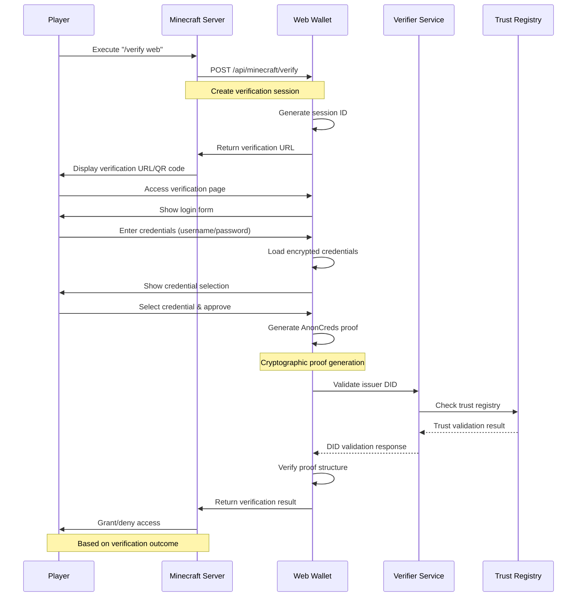

# Minecraft Integration Documentation

## Complete Guide to Minecraft SSI Verification System

This document provides comprehensive information about the Minecraft server integration with the VR Web Wallet, including the verification flow, plugin architecture, and implementation details.

---

## Table of Contents
1. [Integration Overview](#integration-overview)
2. [Verification Flow](#verification-flow)
3. [Session Management](#session-management)
4. [Web Wallet Integration](#web-wallet-integration)
5. [Trust Registry System](#trust-registry-system)
6. [Security Mechanisms](#security-mechanisms)
7. [Implementation Examples](#implementation-examples)
8. [Troubleshooting](#troubleshooting)

---

## Integration Overview

### Architecture Diagram
```
┌─────────────────────┐    ┌─────────────────────┐    ┌─────────────────────┐
│   Minecraft Server  │    │    VR Web Wallet    │    │  Verifier Service   │
│                     │    │                     │    │                     │
│ - SSI Plugin        │◄──►│ - Verification UI   │◄──►│ - Trust Registry    │
│ - Player Commands   │    │ - Proof Generation  │    │ - DID Validation    │
│ - Access Control    │    │ - Session Handling  │    │ - Ledger Integration│
└─────────────────────┘    └─────────────────────┘    └─────────────────────┘
           │                           │                           │
           └───────────────┬───────────────────────┬───────────────┘
                          │                       │
           ┌─────────────────────┐    ┌─────────────────────┐
           │      Player         │    │   BCovrin Ledger    │
           │                     │    │                     │
           │ - Web Browser       │    │ - Schema Registry   │
           │ - Credential Wallet │    │ - Credential Defs   │
           │ - Mobile Access     │    │ - Public Keys       │
           └─────────────────────┘    └─────────────────────┘
```

### Core Components

#### 1. Minecraft Server Side
- **SSI Verification Plugin**: Handles `/verify web` commands
- **Session Management**: Tracks verification requests
- **Access Control**: Grants/denies based on verification results
- **Trust Registry**: Local copy for offline validation

#### 2. Web Wallet Side  
- **Verification Endpoints**: API handlers for Minecraft requests
- **Session Tracking**: Global verification session storage
- **Proof Generation**: AnonCreds cryptographic proofs
- **UI Interface**: Player-friendly verification pages

#### 3. External Services
- **Verifier Service** (port 4002): Trust registry management
- **BCovrin Ledger**: Schema and credential definition storage
- **CouchDB**: User credential storage

---

## Verification Flow

### Complete End-to-End Process



### Step-by-Step Implementation

#### Step 1: Player Initiates Verification
**Location**: Minecraft Server `/verify web` command
```java
// Minecraft plugin command handler
@Override
public boolean onCommand(CommandSender sender, Command command, String label, String[] args) {
    if (command.getName().equalsIgnoreCase("verify")) {
        Player player = (Player) sender;
        
        if (args.length > 0 && args[0].equalsIgnoreCase("web")) {
            initiateWebVerification(player);
            return true;
        }
    }
    return false;
}
```

#### Step 2: Create Verification Session
**File**: `/src/app/api/minecraft/verify/route.ts`
```typescript
export async function POST(request: NextRequest) {
  try {
    const { playerName, playerUUID, requestedAttributes } = await request.json()
    
    // Initialize global sessions if not exists
    if (!globalThis.verificationSessions) {
      globalThis.verificationSessions = []
    }
    
    // Create new verification session
    const sessionId = `web_verify_${Date.now()}`
    const verificationSession = {
      id: sessionId,
      verificationSessionId: sessionId,
      playerName: playerName,
      playerUUID: playerUUID,
      requestedAttributes: requestedAttributes || [
        'name', 'email', 'department', 'issuer_did', 'age'
      ],
      status: 'pending',
      createdAt: new Date().toISOString(),
      requester: {
        playerName: playerName,
        playerUUID: playerUUID,
        source: 'minecraft_server'
      }
    }
    
    // Store session globally  
    globalThis.verificationSessions.push(verificationSession)
    
    // Generate verification URL for player
    const verificationUrl = `${process.env.NEXT_PUBLIC_BASE_URL || 'http://localhost:3001'}/minecraft-verify?sessionId=${sessionId}`
    
    console.log(`🎮 Created verification session for ${playerName}:`, sessionId)
    
    return NextResponse.json({
      success: true,
      verificationUrl: verificationUrl,
      sessionId: sessionId,
      message: 'Verification session created. Player should visit the URL to complete verification.'
    })
    
  } catch (error) {
    console.error('Error creating verification session:', error)
    return NextResponse.json(
      { success: false, error: 'Failed to create verification session' },
      { status: 500 }
    )
  }
}
```

#### Step 3: Player Authentication & Credential Selection
**File**: `/src/app/minecraft-verify/page.tsx:96-131`
```typescript
const handleLogin = async (e: React.FormEvent) => {
  e.preventDefault()
  console.log('🔐 Login attempt for:', loginForm.username)
  setLoading(true)
  
  try {
    // Verify credentials with multi-tenant CouchDB  
    const credentialsResponse = await fetch(
      `/api/credentials?username=${encodeURIComponent(loginForm.username)}&password=${encodeURIComponent(loginForm.password)}`,
      {
        method: 'GET',
        headers: { 'Content-Type': 'application/json' }
      }
    )
    
    const credData = await credentialsResponse.json()
    
    if (credData.success) {
      console.log('✅ Login successful, found', credData.credentials.length, 'credentials')
      
      setUser({ username: loginForm.username, password: loginForm.password })
      setCredentials(credData.credentials)
      
      if (credData.credentials.length > 0) {
        setSelectedCredential(credData.credentials[0]._id)
        console.log('🎯 Default credential selected:', credData.credentials[0]._id)
      }
    } else {
      console.error('❌ Login failed:', credData.error)
      alert('Invalid username or password: ' + credData.error)
    }
  } catch (error) {
    console.error('❌ Login error:', error)
    alert('Login failed: ' + error.message)
  } finally {
    setLoading(false)
  }
}
```

#### Step 4: Cryptographic Proof Generation
**File**: `/src/app/minecraft-verify/page.tsx:147-228`
```typescript
const handleApprove = async () => {
  if (!session || !user || !selectedCredential) return
  
  setVerifying(true)
  try {
    // Generate cryptographic AnonCreds proof instead of sharing raw data
    console.log('🔐 Generating cryptographic proof for verification...')
    
    // Initialize AnonCreds wallet with user credentials
    await anonCredsWallet.initialize({
      walletId: user.username,
      walletKey: user.password,
      endpoint: 'http://localhost:3001'
    })

    // Create AnonCreds proof request from session requirements
    const proofRequest: ProofRequestAnonCreds = {
      name: 'Minecraft Web Verification',
      version: '1.0',
      nonce: Math.random().toString().substring(2, 12),
      requested_attributes: {},
      requested_predicates: {},
      non_revoked: {
        from: 0,
        to: Math.floor(Date.now() / 1000)
      }
    }

    // Build requested attributes from session requirements
    if (session.requestedAttributes) {
      for (let i = 0; i < session.requestedAttributes.length; i++) {
        const attrName = session.requestedAttributes[i]
        proofRequest.requested_attributes[`attr_${i}_${attrName}`] = {
          name: attrName,
          restrictions: []
        }
      }
    }

    // Get credential from CouchDB storage
    const selectedCred = credentials.find(c => c._id === selectedCredential)
    if (!selectedCred || !selectedCred.encryptedCredential) {
      alert('Selected credential not found or not encrypted')
      return
    }

    // Decrypt credential to extract data for proof generation
    const encryptionKey = await deriveEncryptionKey(user.password, user.username)
    const { decryptCredential } = await import('@/lib/encryption')
    const fullCredential = await decryptCredential(selectedCred.encryptedCredential, encryptionKey)
    
    console.log('🔓 Full credential decrypted for proof generation:', Object.keys(fullCredential))

    // Generate cryptographic proof from the decrypted credential
    const cryptographicProof = await generateAnonCredsProofFromCredential(
      proofRequest, 
      fullCredential, 
      selectedCred
    )
    
    if (!cryptographicProof) {
      alert('Failed to generate cryptographic proof from credential data')
      return
    }

    console.log('✅ Cryptographic proof generated successfully')
    
    // Send the cryptographic proof to Minecraft
    const response = await fetch(`/api/minecraft/verify/${session.id}`, {
      method: 'POST',
      headers: { 'Content-Type': 'application/json' },
      body: JSON.stringify({
        action: 'share',
        proof: {
          type: 'anoncreds',
          proofRequest: proofRequest,
          proof: cryptographicProof
        }
      })
    })

    const result = await response.json()
    if (result.success) {
      alert('Verification successful!')
    } else {
      alert('Verification failed: ' + result.message)
    }
    
  } catch (proofError) {
    console.error('❌ Cryptographic proof generation failed:', proofError)
    alert('Failed to generate cryptographic proof: ' + proofError.message)
  } finally {
    setVerifying(false)
  }
}
```

#### Step 5: Proof Verification & Trust Validation
**File**: `/src/app/api/minecraft/verify/[sessionId]/route.ts:248-404`
```typescript
async function verifyAnonCredsProof(session: any, proofRequest: any, proof: any) {
  console.log('🔐 Verifying cryptographic AnonCreds proof...')
  
  try {
    // 1. Extract proof components
    const revealedAttrs = proof.requested_proof?.revealed_attrs || {}
    const identifiers = proof.identifiers || []
    
    // 2. Validate proof structure
    if (!proof.proof || !proof.requested_proof || identifiers.length === 0) {
      return {
        isValid: false,
        message: '❌ Invalid AnonCreds proof structure',
        details: { error: 'Missing required proof components' }
      }
    }

    // 3. Cryptographic verification
    let cryptographicVerification = false
    if (proof.proof.proofs && proof.proof.aggregated_proof) {
      cryptographicVerification = true
      console.log('✅ Cryptographic proof structure is valid')
    }

    // 4. Attribute verification
    const requiredAttributes = session.requestedAttributes || []
    let attributeMatches = []
    let missingAttributes = []

    for (const requiredAttr of requiredAttributes) {
      let found = false
      
      for (const [attrKey, attrValue] of Object.entries(revealedAttrs)) {
        if (attrKey.includes(requiredAttr) || attrKey.endsWith(requiredAttr)) {
          attributeMatches.push({
            required: requiredAttr,
            provided: attrKey,
            value: (attrValue as any).raw,
            encoded: (attrValue as any).encoded
          })
          found = true
          break
        }
      }
      
      if (!found) {
        missingAttributes.push(requiredAttr)
      }
    }

    // 5. Extract issuer DID for trust validation
    let issuerDID = ''
    if (identifiers.length > 0) {
      const credDefId = identifiers[0].cred_def_id
      if (credDefId) {
        issuerDID = credDefId.split(':')[0] // Extract DID from cred_def_id
      }
    }

    // 6. Trust registry validation
    let didValidationPassed = false
    let didValidationMessage = ''

    try {
      const trustedDIDsResponse = await fetch('http://localhost:4002/v2/trusted-dids')
      const trustedDIDsData = await trustedDIDsResponse.json()
      
      if (trustedDIDsData.success && trustedDIDsData.data) {
        const isTrusted = trustedDIDsData.data.some((trusted: any) => trusted.did === issuerDID)
        
        if (isTrusted) {
          didValidationPassed = true
          didValidationMessage = `Cryptographically verified by trusted issuer: ${issuerDID}`
        } else {
          didValidationPassed = false
          didValidationMessage = `DID ${issuerDID} is not in trusted registry`
        }
      }
    } catch (error) {
      didValidationPassed = false
      didValidationMessage = 'Failed to validate issuer against trust registry'
    }

    // 7. Final verification result
    const allAttributesProvided = missingAttributes.length === 0
    const isValid = cryptographicVerification && allAttributesProvided && didValidationPassed

    let message: string
    if (!cryptographicVerification) {
      message = `❌ Cryptographic verification FAILED!`
    } else if (!allAttributesProvided) {
      message = `❌ Attribute verification FAILED! Missing: ${missingAttributes.join(', ')}`
    } else if (!didValidationPassed) {
      message = `❌ Issuer validation FAILED! ${didValidationMessage}`
    } else {
      message = `✅ Cryptographic proof VERIFIED! ${didValidationMessage}`
    }

    return {
      isValid,
      message,
      details: {
        cryptographicVerification,
        attributeMatches,
        missingAttributes,
        proofType: 'AnonCreds',
        issuerDID
      },
      didValidation: {
        passed: didValidationPassed,
        message: didValidationMessage
      }
    }

  } catch (error) {
    console.error('❌ AnonCreds proof verification error:', error)
    return {
      isValid: false,
      message: '❌ Cryptographic proof verification failed: ' + error.message,
      details: { error: error.message, proofType: 'AnonCreds' }
    }
  }
}
```

---

## Session Management

### Global Session Storage
**File**: `/src/app/api/minecraft/verify/[sessionId]/route.ts:3-6`

The system uses global session storage for stateless verification:

```typescript
declare global {
  var verificationSessions: any[] | undefined;
}
```

### Session Structure
```typescript
interface VerificationSession {
  id: string                    // Unique session identifier
  verificationSessionId: string // Alternative session reference
  playerName: string           // Minecraft player name
  playerUUID: string           // Minecraft player UUID
  requestedAttributes: string[] // Attributes to verify
  status: 'pending' | 'verified' | 'failed' | 'declined'
  createdAt: string            // ISO timestamp
  completedAt?: string         // Completion timestamp
  requester: {
    playerName: string
    playerUUID: string
    source: 'minecraft_server'
  }
  proofReceived?: any          // Submitted proof data
  verificationResult?: {
    isValid: boolean
    message: string
    details: any
  }
}
```

### Session Lifecycle Management

#### Session Creation
```typescript
const sessionId = `web_verify_${Date.now()}`
const verificationSession = {
  id: sessionId,
  verificationSessionId: sessionId,
  playerName: playerName,
  playerUUID: playerUUID,
  requestedAttributes: ['name', 'email', 'department', 'issuer_did', 'age'],
  status: 'pending',
  createdAt: new Date().toISOString(),
  requester: {
    playerName: playerName,
    playerUUID: playerUUID,
    source: 'minecraft_server'
  }
}

globalThis.verificationSessions.push(verificationSession)
```

#### Session Updates
```typescript
// Find session by ID or verificationSessionId
const sessionIndex = globalThis.verificationSessions.findIndex(
  (session: any) => session.id === sessionId || session.verificationSessionId === sessionId
)

if (sessionIndex !== -1) {
  const session = globalThis.verificationSessions[sessionIndex]
  
  // Update session with verification result
  session.status = verificationResult.isValid ? 'verified' : 'failed'
  session.proofReceived = proof
  session.verificationResult = verificationResult
  session.completedAt = new Date().toISOString()
}
```

#### Session Cleanup
Currently sessions persist in memory. For production:
- Implement session expiration (e.g., 15 minutes)
- Add periodic cleanup processes
- Consider persistent storage for audit trails

---

## Web Wallet Integration

### Verification Page Interface
**File**: `/src/app/minecraft-verify/page.tsx`

The Minecraft verification page provides:

#### 1. Session Loading
```typescript
useEffect(() => {
  console.log('🎮 Minecraft verify page loaded')
  
  // Get session ID from URL params
  const urlParams = new URLSearchParams(window.location.search)
  const sessionId = urlParams.get('sessionId')
  const playerName = urlParams.get('player')
  
  if (!sessionId) {
    console.error('❌ No session ID provided')
    setLoading(false)
    return
  }

  loadSession(sessionId)
}, [])
```

#### 2. Multi-step UI Flow
1. **Session Loading**: Retrieve verification request details
2. **Authentication**: Username/password login form
3. **Credential Selection**: Choose from available credentials
4. **Proof Generation**: Create cryptographic proof
5. **Verification**: Submit proof and show results

#### 3. Responsive Design
```typescript
// VR/AR optimized components
<VRCard className="w-full max-w-md">
  <div className="text-center mb-6">
    <h1 className="vr-title mb-2">🎮 Minecraft Verification</h1>
    <p className="vr-body text-tertiary">Login to verify your identity</p>
  </div>
  
  <VRButton 
    variant="primary" 
    size="lg"
    onClick={handleApprove}
    disabled={verifying || !selectedCredential}
  >
    {verifying ? 'Verifying...' : 'Share & Verify'}
  </VRButton>
</VRCard>
```

### Mobile & VR Support
- **Large touch targets** for VR controllers
- **High contrast design** for various display types
- **Simple navigation** suitable for immersive environments
- **Auto-close functionality** after verification

---

## Trust Registry System

### Verifier Service Integration
**Endpoint**: `http://localhost:4002/v2/trusted-dids`
**Purpose**: Centralized trust registry for issuer validation

#### Trust Registry Response
```json
{
  "success": true,
  "data": [
    {
      "did": "HWwwsNgvurPQg36aALfBfv",
      "name": "Web Issuer",
      "addedDate": "2025-08-29T06:38:08.592Z",
      "addedBy": "admin"
    },
    {
      "did": "14Eyuai4HZ491AfnA43Amr", 
      "name": "Swapnil",
      "addedDate": "2025-08-30T17:02:36.038Z",
      "addedBy": "admin"
    }
  ],
  "count": 2,
  "source": "ledger"
}
```

### DID Extraction & Validation

#### From Proof Identifiers
```typescript
// Extract issuer DID from credential definition ID
// Format: "DID:3:CL:1:default" -> extract the DID (first part)
if (credentialIdentifier.cred_def_id) {
  const credDefParts = credentialIdentifier.cred_def_id.split(':')
  if (credDefParts.length >= 1) {
    issuerDID = credDefParts[0] // First part is the issuer DID
  }
}

// Fallback: check revealed attributes for issuer_did
if (!issuerDID && revealedAttrs) {
  for (const [attrKey, attrValue] of Object.entries(revealedAttrs)) {
    if (attrKey.includes('issuer_did') || attrKey.endsWith('issuer_did')) {
      issuerDID = (attrValue as any).raw
      console.log('🔍 Found issuer DID in revealed attributes:', issuerDID)
      break
    }
  }
}
```

#### Trust Validation Logic
```typescript
try {
  const trustedDIDsResponse = await fetch('http://localhost:4002/v2/trusted-dids')
  const trustedDIDsData = await trustedDIDsResponse.json()
  
  if (trustedDIDsData.success && trustedDIDsData.data) {
    const isTrusted = trustedDIDsData.data.some((trusted: any) => trusted.did === issuerDID)
    
    if (isTrusted) {
      didValidationPassed = true
      didValidationMessage = `Cryptographically verified by trusted issuer: ${issuerDID}`
      console.log(`✅ DID ${issuerDID} is trusted`)
    } else {
      didValidationPassed = false
      didValidationMessage = `DID ${issuerDID} is not in trusted registry`
      console.log(`❌ DID ${issuerDID} not found in trusted list`)
    }
  }
} catch (error) {
  console.error('Trust registry validation error:', error)
  didValidationPassed = false
  didValidationMessage = 'Failed to validate with trust registry'
}
```

### Trust Management Best Practices

#### 1. Registry Synchronization
- **Real-time validation** against external trust service
- **Fallback mechanisms** for network failures
- **Cache management** for performance optimization
- **Audit logging** for trust decisions

#### 2. DID Format Handling
- **Flexible parsing** for different DID formats
- **Multiple extraction methods** (identifiers vs attributes)
- **Validation error handling** for malformed DIDs
- **Backwards compatibility** with existing credentials

---

## Security Mechanisms

### 1. Authentication Security
- **Multi-tenant isolation**: Separate databases per user
- **Password-based authentication**: PBKDF2 key derivation
- **Session-based verification**: Time-limited sessions
- **Secure credential storage**: AES-256-GCM encryption

### 2. Proof Security
- **Cryptographic signatures**: Tamper-evident proofs
- **Zero-knowledge properties**: Selective attribute disclosure
- **Replay protection**: Nonce-based proof requests
- **Trust validation**: Registry-based issuer verification

### 3. Transport Security
- **HTTPS enforcement**: Encrypted data transmission
- **CORS policies**: Cross-origin request protection
- **Input validation**: Sanitized request parameters
- **Error handling**: No information leakage

### 4. Access Control
- **Credential-based access**: Proof-of-identity required
- **Attribute requirements**: Configurable verification criteria
- **Trust policies**: Only trusted issuers accepted
- **Audit trails**: Complete verification logging

---

## Implementation Examples

### Complete Minecraft Integration Test

```bash
#!/bin/bash
# Complete integration test script

echo "🎮 Testing Minecraft SSI Integration"

# 1. Start required services
echo "Starting services..."
docker start couchdb
cd /path/to/ssi-tutorial && npm run verifier &
cd /path/to/vr-web-wallet && npm run dev &
cd /path/to/minecraft-server && ./start-with-ssi.sh &

sleep 10

# 2. Create verification session
echo "Creating verification session..."
RESPONSE=$(curl -s -X POST http://localhost:3001/api/minecraft/verify \
  -H "Content-Type: application/json" \
  -d '{
    "playerName": "testPlayer",
    "playerUUID": "test-uuid-123",
    "requestedAttributes": ["name", "email", "department"]
  }')

SESSION_ID=$(echo $RESPONSE | jq -r '.sessionId')
VERIFICATION_URL=$(echo $RESPONSE | jq -r '.verificationUrl')

echo "✅ Session created: $SESSION_ID"
echo "🔗 Verification URL: $VERIFICATION_URL"

# 3. Simulate player verification (would be done via browser)
echo "Player would visit: $VERIFICATION_URL"

# 4. Check session status
echo "Checking session status..."
curl -s http://localhost:3001/api/minecraft/verify/$SESSION_ID | jq '.'

echo "🏁 Integration test complete"
```

### Proof Generation Example

```javascript
// Complete proof generation example
async function generateMinecraftProof(username, password, sessionId) {
  try {
    // 1. Authenticate user
    const loginResponse = await fetch(`/api/credentials?username=${username}&password=${password}`)
    const { credentials } = await loginResponse.json()
    
    if (credentials.length === 0) {
      throw new Error('No credentials found for user')
    }

    // 2. Get session details
    const sessionResponse = await fetch(`/api/minecraft/verify/${sessionId}`)
    const { session } = await sessionResponse.json()
    
    // 3. Create proof request
    const proofRequest = {
      name: 'Minecraft Web Verification',
      version: '1.0',
      nonce: Math.random().toString().substring(2, 12),
      requested_attributes: {},
      requested_predicates: {},
      non_revoked: {
        from: 0,
        to: Math.floor(Date.now() / 1000)
      }
    }
    
    // Build attributes from session requirements
    session.requestedAttributes.forEach((attr, index) => {
      proofRequest.requested_attributes[`attr_${index}_${attr}`] = { name: attr }
    })

    // 4. Decrypt credential
    const encryptionKey = await deriveEncryptionKey(password, username)
    const decryptedCredential = await decryptCredential(
      credentials[0].encryptedCredential, 
      encryptionKey
    )

    // 5. Generate proof
    const proof = await generateAnonCredsProofFromCredential(
      proofRequest,
      decryptedCredential,
      credentials[0]
    )

    // 6. Submit proof
    const verificationResponse = await fetch(`/api/minecraft/verify/${sessionId}`, {
      method: 'POST',
      headers: { 'Content-Type': 'application/json' },
      body: JSON.stringify({
        action: 'share',
        proof: {
          type: 'anoncreds',
          proofRequest: proofRequest,
          proof: proof
        }
      })
    })

    const result = await verificationResponse.json()
    console.log('Verification result:', result)
    
    return result

  } catch (error) {
    console.error('Proof generation failed:', error)
    throw error
  }
}

// Usage
generateMinecraftProof('swap', '12345678', 'web_verify_1756571810206')
  .then(result => {
    if (result.verified) {
      console.log('✅ Player verified successfully!')
    } else {
      console.log('❌ Verification failed:', result.message)
    }
  })
```

---

## Troubleshooting

### Common Issues & Solutions

#### 1. "Verification session not found"
**Cause**: Session ID mismatch or expired session
**Solution**: Check URL parameters and session creation
**Debug**: 
```bash
curl http://localhost:3001/api/debug/sessions
```

#### 2. "No available credentials for proof generation"
**Cause**: User has no stored credentials or login failed
**Solution**: Verify credential storage and authentication
**Debug**:
```bash
curl "http://localhost:3001/api/credentials?username=swap&password=12345678"
```

#### 3. "DID not in trusted registry"
**Cause**: Issuer DID not in trust registry or extraction failed
**Solution**: Check trust registry and DID extraction logic
**Debug**:
```bash
curl http://localhost:4002/v2/trusted-dids
```

#### 4. "Cryptographic verification failed"
**Cause**: Invalid proof structure or missing components
**Solution**: Verify proof generation and structure
**Debug**: Check console logs for proof generation details

### Debug Endpoints

#### Session Status
```bash
GET /api/minecraft/verify/[sessionId]
```

#### Trust Registry
```bash
GET http://localhost:4002/v2/trusted-dids
```

#### User Credentials
```bash
GET /api/credentials?username=X&password=Y
```

#### All Sessions (Debug)
```bash
GET /api/debug/sessions
```

### Error Handling Patterns

#### Client-side Error Handling
```typescript
try {
  const response = await fetch('/api/minecraft/verify', {
    method: 'POST',
    headers: { 'Content-Type': 'application/json' },
    body: JSON.stringify(requestData)
  })
  
  const result = await response.json()
  
  if (!result.success) {
    console.error('API Error:', result.error)
    alert(`Verification failed: ${result.error}`)
    return
  }
  
  // Handle success
  console.log('Verification successful:', result.message)
  
} catch (error) {
  console.error('Network Error:', error)
  alert('Network error occurred. Please try again.')
}
```

#### Server-side Error Handling
```typescript
export async function POST(request: NextRequest) {
  try {
    const data = await request.json()
    
    // Validate input
    if (!data.playerName || !data.playerUUID) {
      return NextResponse.json(
        { success: false, error: 'Missing required fields' },
        { status: 400 }
      )
    }
    
    // Process request
    const result = await processVerificationRequest(data)
    
    return NextResponse.json({
      success: true,
      ...result
    })
    
  } catch (error) {
    console.error('API Error:', error)
    return NextResponse.json(
      { success: false, error: 'Internal server error' },
      { status: 500 }
    )
  }
}
```

This Minecraft integration provides a complete, secure SSI verification system for gaming platforms, demonstrating how Self-Sovereign Identity can enhance player authentication and access control in virtual environments.