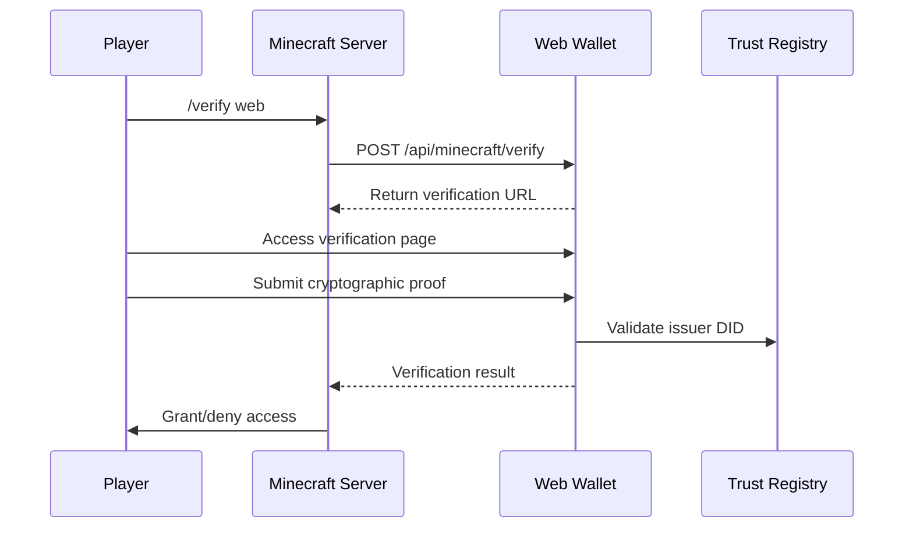

# VR Web Wallet - Self-Sovereign Identity System

A comprehensive **Self-Sovereign Identity (SSI)** wallet built with **Next.js 14** and **AnonCreds** cryptographic proofs, featuring **Minecraft integration** and **VR/AR optimized interfaces**.

---

## 🚀 Quick Start

### Prerequisites
- **Node.js 18+**
- **CouchDB** (credentials storage)
- **Verifier Service** (trust registry)

### Installation
```bash
# Clone the repository
git clone <repository-url>
cd vr-web-wallet

# Install dependencies
npm install

# Start development server
npm run dev
```

The wallet will be available at `http://localhost:3001`

---

## 🏗️ Architecture Overview

```
┌─────────────────────┐    ┌─────────────────────┐    ┌─────────────────────┐
│   Frontend (React)  │◄──►│   API Layer (REST)  │◄──►│   Storage Layer     │
│                     │    │                     │    │                     │
│ - Credential UI     │    │ - Authentication    │    │ - CouchDB           │
│ - Proof Generation  │    │ - Verification      │    │ - IndexedDB         │
│ - VR Interface      │    │ - Trust Registry    │    │ - File Storage      │
└─────────────────────┘    └─────────────────────┘    └─────────────────────┘
           │                           │                           │
           └───────────────┬───────────────────────┬───────────────┘
                          │                       │
           ┌─────────────────────┐    ┌─────────────────────┐
           │  External Services  │    │   Minecraft Server  │
           │                     │    │                     │
           │ - BCovrin Ledger    │    │ - SSI Plugin        │
           │ - Verifier Service  │    │ - Player Verification│
           │ - ACA-Py Agents     │    │ - Trust Registry    │
           └─────────────────────┘    └─────────────────────┘
```

### Core Features
- ✅ **Cryptographic Proofs**: AnonCreds zero-knowledge proofs
- ✅ **Multi-tenant Storage**: Encrypted credential storage per user
- ✅ **Minecraft Integration**: Gaming platform verification
- ✅ **VR/AR Optimized**: Large UI elements for immersive devices
- ✅ **Trust Registry**: Issuer validation system
- ✅ **Mobile Responsive**: Cross-platform compatibility

---

## 🔐 Cryptographic Security

### Encryption Stack
- **AES-256-GCM**: Credential encryption
- **PBKDF2**: Key derivation (100,000 iterations)
- **Web Crypto API**: Browser-native cryptography
- **Zero-Knowledge Proofs**: Selective attribute disclosure

### Security Features
```typescript
// Example: Credential encryption
const encryptionKey = await deriveEncryptionKey(password, username)
const encryptedCredential = await encryptCredential(credential, encryptionKey)

// Example: AnonCreds proof generation
const proof = await anonCredsWallet.generateProof(proofRequest)
```

**Security Benefits**:
- 🔒 **Tamper-proof**: Cryptographic signatures prevent forgery
- 🔒 **Privacy-preserving**: Only requested attributes revealed
- 🔒 **Non-repudiation**: Digital signatures prove authenticity
- 🔒 **Trust validation**: Registry-based issuer verification

---

## 🎮 Minecraft Integration

### Verification Flow


### Usage Example
```bash
# In Minecraft server console or as player
/verify web

# Player visits generated URL:
# http://localhost:3001/minecraft-verify?sessionId=web_verify_123456
```

**Integration Features**:
- 🎮 **Player Commands**: Simple `/verify web` command
- 🎮 **QR Code Support**: Mobile-friendly verification
- 🎮 **Real-time Status**: Live verification updates
- 🎮 **Trust Enforcement**: Only trusted issuers accepted

---

## 📁 Project Structure

```
vr-web-wallet/
├── src/
│   ├── app/                    # Next.js App Router
│   │   ├── api/               # API endpoints
│   │   │   ├── credentials/   # Credential management
│   │   │   ├── minecraft/     # Minecraft integration
│   │   │   └── notifications/ # Notification system
│   │   ├── credentials/       # Credential UI pages
│   │   ├── minecraft-verify/  # Minecraft verification
│   │   └── notifications/     # Notification UI
│   ├── components/            # React components
│   │   ├── VRButton.tsx      # VR-optimized components
│   │   ├── CredentialCard.tsx # Credential display
│   │   └── MinecraftConnection.tsx # Gaming integration
│   └── lib/                   # Core libraries
│       ├── anoncreds-wallet-agent.ts # Cryptographic proofs
│       ├── wallet-crypto.ts   # Encryption utilities
│       ├── encryption.ts      # Credential encryption
│       └── couchdb-auth.ts   # Database operations
├── package.json              # Dependencies
└── tailwind.config.js        # UI styling
```

---

## 🛠️ API Documentation

### Authentication
```bash
# Store encrypted credential
POST /api/credentials
{
  "credential": "encrypted_data",
  "username": "user123",
  "password": "secure_password"
}

# Retrieve user credentials
GET /api/credentials?username=user123&password=secure_password
```

### Minecraft Integration
```bash
# Initiate verification
POST /api/minecraft/verify
{
  "playerName": "aceSwap",
  "playerUUID": "uuid-string",
  "requestedAttributes": ["name", "email", "department"]
}

# Submit cryptographic proof
POST /api/minecraft/verify/[sessionId]
{
  "action": "share",
  "proof": {
    "type": "anoncreds",
    "proof": {
      "proof": {"proofs": [...], "aggregated_proof": {...}},
      "requested_proof": {"revealed_attrs": {...}},
      "identifiers": [{"cred_def_id": "DID:3:CL:1:default"}]
    }
  }
}
```

### Trust Registry
```bash
# Check trusted DIDs
GET http://localhost:4002/v2/trusted-dids

Response:
{
  "success": true,
  "data": [
    {
      "did": "14Eyuai4HZ491AfnA43Amr",
      "name": "Swapnil",
      "addedDate": "2025-08-30T17:02:36.038Z"
    }
  ]
}
```

---

## 💻 Development Guide

### Environment Setup
```bash
# Start required services
docker run -d -p 5984:5984 --name couchdb \
  -e COUCHDB_USER=admin -e COUCHDB_PASSWORD=password \
  couchdb:3.2

# Start verifier service (port 4002)
cd ssi-tutorial && npm run verifier

# Start web wallet (port 3001)
npm run dev
```

### Configuration
```typescript
// Environment variables
const COUCHDB_URL = process.env.COUCHDB_URL || 'http://localhost:5984'
const VERIFIER_URL = process.env.VERIFIER_URL || 'http://localhost:4002'
const WALLET_PORT = process.env.PORT || 3001
```

### Development Commands
```json
{
  "scripts": {
    "dev": "next dev -p 3001",
    "build": "next build",
    "start": "next start -p 3001",
    "lint": "next lint",
    "type-check": "tsc --noEmit",
    "test:anoncreds": "Navigate to http://localhost:3001/anoncreds-test"
  }
}
```

---

## 🧪 Testing & Examples

### Credential Storage Test
```javascript
// Store a test credential
const response = await fetch('http://localhost:3001/api/credentials', {
  method: 'POST',
  headers: { 'Content-Type': 'application/json' },
  body: JSON.stringify({
    credential: 'encrypted_test_data',
    username: 'testuser',
    password: 'testpass'
  })
})

console.log('Storage result:', await response.json())
```

### Minecraft Verification Test
```javascript
// Create verification session
const verificationResponse = await fetch('http://localhost:3001/api/minecraft/verify', {
  method: 'POST',
  headers: { 'Content-Type': 'application/json' },
  body: JSON.stringify({
    playerName: 'testPlayer',
    requestedAttributes: ['name', 'email', 'department']
  })
})

const { verificationUrl, sessionId } = await verificationResponse.json()
console.log('Visit:', verificationUrl)
```

### Cryptographic Proof Generation
```javascript
// Generate AnonCreds proof
const wallet = anonCredsWallet.getInstance()
await wallet.initialize({
  walletId: 'user123',
  walletKey: 'password123'
})

const proofRequest = {
  name: 'Test Verification',
  version: '1.0',
  nonce: '1234567890',
  requested_attributes: {
    attr_name: { name: 'name' },
    attr_email: { name: 'email' }
  },
  requested_predicates: {}
}

const proof = await wallet.generateProof(proofRequest)
console.log('Generated proof:', !!proof)
```

---

## 🚨 Troubleshooting

### Common Issues

#### "No available credentials for proof generation"
**Cause**: Empty credential storage or authentication failure
**Solution**: 
```bash
# Check credential storage
curl "http://localhost:3001/api/credentials?username=swap&password=12345678"

# Verify CouchDB connection
curl http://localhost:5984
```

#### "DID not in trusted registry"
**Cause**: Issuer DID not trusted or extraction failed
**Solution**:
```bash
# Check trust registry
curl http://localhost:4002/v2/trusted-dids

# Verify DID format in proof
console.log('Extracted DID:', proof.identifiers[0].cred_def_id.split(':')[0])
```

#### "Cryptographic verification failed"
**Cause**: Invalid proof structure or missing components
**Solution**: Check proof generation logs and ensure all required components exist

### Debug Endpoints
```bash
# Session status
GET /api/minecraft/verify/[sessionId]

# All sessions (debug)
GET /api/debug/sessions

# Trust registry
GET http://localhost:4002/v2/trusted-dids

# User credentials
GET /api/credentials?username=X&password=Y
```

---

## 📖 Documentation

### Comprehensive Guides
- **[COMPREHENSIVE_DOCUMENTATION.md](COMPREHENSIVE_DOCUMENTATION.md)** - Complete technical guide
- **[API_REFERENCE.md](API_REFERENCE.md)** - Detailed API documentation
- **[CRYPTOGRAPHIC_IMPLEMENTATION.md](CRYPTOGRAPHIC_IMPLEMENTATION.md)** - Encryption & proof details
- **[MINECRAFT_INTEGRATION.md](MINECRAFT_INTEGRATION.md)** - Gaming platform integration

### Key Components Documentation
- **Authentication**: Multi-tenant CouchDB with encrypted storage
- **Cryptography**: AnonCreds proofs with Web Crypto API
- **Integration**: Minecraft server SSI verification
- **UI/UX**: VR/AR optimized responsive design

---

## 🔍 Key Implementation Files

### Core Cryptographic Components
- **`/src/lib/anoncreds-wallet-agent.ts`** - AnonCreds proof generation
- **`/src/lib/wallet-crypto.ts`** - Web Crypto API encryption  
- **`/src/lib/encryption.ts`** - Credential encryption utilities

### Minecraft Integration
- **`/src/app/minecraft-verify/page.tsx`** - Player verification interface
- **`/src/app/api/minecraft/verify/[sessionId]/route.ts`** - Proof verification logic
- **`/src/components/MinecraftConnection.tsx`** - Gaming UI components

### Authentication & Storage
- **`/src/lib/couchdb-auth.ts`** - Multi-tenant database operations
- **`/src/app/api/credentials/route.ts`** - Credential storage API
- **`/src/app/credentials/page.tsx`** - Credential management UI

---

## 🌟 Features Highlight

### ✅ Production-Ready Security
- **AES-256-GCM encryption** for credential storage
- **PBKDF2 key derivation** with 100,000 iterations
- **Zero-knowledge proofs** for privacy-preserving verification
- **Trust registry validation** for issuer authentication

### ✅ Gaming Integration
- **Minecraft server plugin** support
- **Real-time verification** sessions
- **Player-friendly interfaces** with QR codes
- **Access control** based on cryptographic proofs

### ✅ Developer Experience
- **TypeScript throughout** for type safety
- **Comprehensive documentation** with examples
- **API-first design** for easy integration
- **Modular architecture** for extensibility

### ✅ VR/AR Ready
- **Large touch targets** for VR controllers
- **High contrast design** for various displays
- **Simple navigation** for immersive environments
- **Responsive layout** across devices

---

## 🚀 Getting Started Checklist

1. **[ ]** Install dependencies with `npm install`
2. **[ ]** Start CouchDB container for credential storage
3. **[ ]** Start verifier service for trust registry
4. **[ ]** Run development server with `npm run dev`
5. **[ ]** Test credential storage at `/credentials`
6. **[ ]** Test Minecraft integration at `/minecraft-verify`
7. **[ ]** Review documentation files for deep understanding
8. **[ ]** Configure trust registry with your issuer DIDs

---

## 📞 Support & Contributing

### Getting Help
- **Documentation**: Check the comprehensive guides in this repository
- **Debug Endpoints**: Use the built-in debug APIs for troubleshooting
- **Console Logs**: Enable browser console for detailed cryptographic operation logs

### Contributing
- **Code Style**: Follow TypeScript best practices and existing patterns
- **Testing**: Add tests for new cryptographic components
- **Documentation**: Update relevant documentation for new features
- **Security**: Follow security best practices for cryptographic implementations

This VR Web Wallet demonstrates a complete, production-ready **Self-Sovereign Identity** system with **cryptographic security**, **gaming integration**, and **immersive user interfaces**.